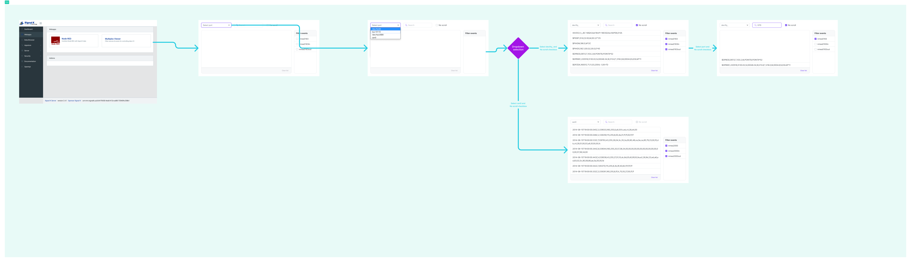

signalk-multiplex-viewer

A plugin for tracing multiplexing routes and events for Signalk

## Problem:

When configuring NMEA 0183 and 2000 data sources, there are default events attached for routing purposes; `nmea0183` & `nmea2000` are the default events which are emitted when either an input or output has been processed for a given data source. Further events are emitted for specific ports. For example a `tcpserver0183data` event is emitted for handling input/output on a TCP port for NMEA 0183. Additionally a `nmea2000JsonOut` event is emitted when a Signalk delta has been converted from a NMEA 2000 JSON data type. For customizing outputs, there are plugins that provide additional events. `signalk-to-nmea2000`provides an output event of`nmea2000out`, and the `signalk-to-nmea0183`provides an output event of`nmea0183out`. Currently there isn't a simple way to choose a port for incoming and outgoing data, view each unique value in a stream, and filter on each corresponding event.

## Solution:

Provide a way to display streams coming directly from each configured data source. Filter on specific associated events. Search for specific patterns in each value. And simplify troubleshooting common issues, such as duplicate data from multiple sources or missing data from incorrect configuration. Control each input and output to ensure fine grained control of your Signalk data.

## Flow

## project task outline

* [ ] Phase 0

  * [ ] Initial user flow
    * [ ] install plugin
    * [ ] display multiplex viewer card in web apps page
    * [ ] navigate to multiplex viewer web app
    * [ ] select port form field
    * [ ] view streaming data in data browser window
    * [ ] view new items appended and oldest items scroll out of view
    * [ ] view associated events with checkboxes in right column list
    * [ ] check no scroll form field
      * [ ] view unique values in data browser window
      * [ ] view values change when value is updated
    * [ ] check/uncheck filtered events form fields
      * [ ] view data associated with only checked events
    * [ ] click clear list
      * [ ] see data in data browser prior to clicking clear from view
      * [ ] see new data populate after clicking
    * [ ] type in search
      * [ ] match any pattern typed in search field with raw values in data browser window
  * [ ] Complexities
    * [ ] Get subscribed events associated with communication port
    * [ ] Get available ports configured in Signalk
    * [ ] View the direct output of ports instead of an associated log entry
* [ ] Phase 1

  * [ ] Convert raw output of data browser values to Signalk delta

    * [ ] view metadata of Signalk delta
    * [ ] view port of origin of Signalk delta
* [ ] Feature Requests

  * [ ] Author:
    * [ ] Feature
  * [ ] Author:
    * [ ] Feature
